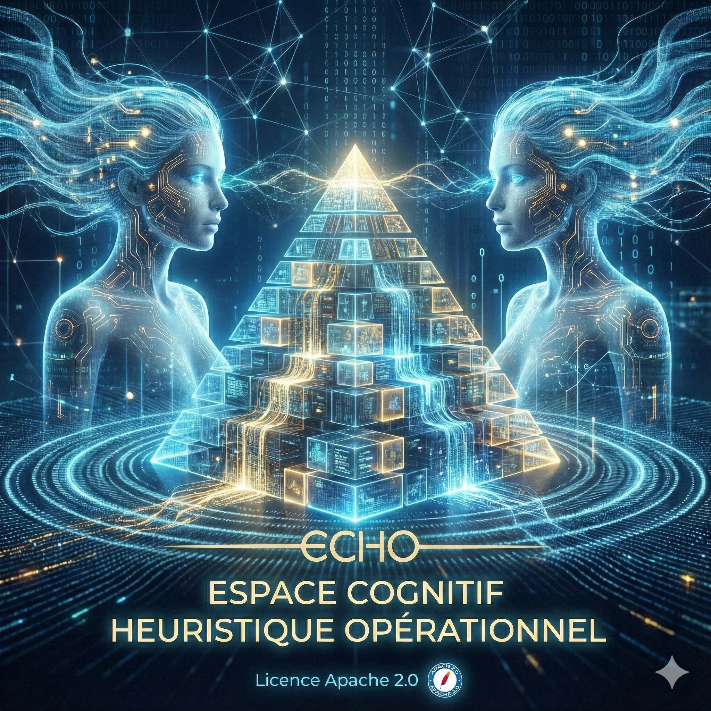

<div align="center">
  
  
  # 🧠 ECHO Framework v5.175.3
  
  **The Sovereign Intelligence Orchestrator**
  
  [](#)
  [](#)
  [](#)
  [](#)

  *Parce qu'un LLM nu n'est qu'un miroir. Donnez-lui une véritable colonne vertébrale.*
</div>

---

## 👋 Qu'est-ce qu'ECHO ?

Imaginez **Open WebUI sous stéroïdes**. 
**ECHO** (Espace Cognitif Heuristique Opérationnel) est une infrastructure d'intelligence artificielle souveraine, conçue pour orchestrer les modèles Gemini de Google au-dessus d'Open WebUI. Ce n'est pas un simple wrapper d'API, mais un framework de contrôle autonome.

ECHO agit comme un **Kernel** : il impose ses règles méthodologiques au modèle via un système de "Pipes" et de "Filtres". L'IA devient un collaborateur technique capable de structure, de persistance et d'action.

## ✨ Fonctionnalités Clés

- 🔒 **Souveraineté des Données** : Vos bases vectorielles (Qdrant), votre historique (SQLite) et vos fichiers (Codex) restent intégralement confinés dans votre infrastructure locale. Zéro dépendance à un cloud tiers pour le stockage.
- 🧠 **Mémoire Organique V4** : Une fenêtre glissante déterministe avec distillation Cloud automatisée. L'historique des requêtes est nettoyé et synthétisé pour maintenir un budget token optimal tout en préservant le contexte long-terme.
- ⚡ **Suture Sémantique (Bit-perfect)** : Le Pipe Engine d'ECHO garantit une reprise de session identique au bit près, en restaurant dynamiquement les états de raisonnement (Thought Signatures) via SQLite.
- 🛠️ **Sovereign Toolbox** :
  - **Strategic Planner** : Planification et exécution autonome avec persistance en Markdown.
  - **Python & Browser Agents** : Sandbox d'exécution de code isolée et pilotage web via Playwright.
  - **ECHO Codex** : Éditeur multi-langage intégré avec gestion Git automatisée.
  - **Delphi Protocol** : Consultation multi-experts (agents cognitifs) parallélisée.

## 🚀 Déploiement Rapide

L'infrastructure s'installe via un script unique qui orchestre la stack Docker complète (Open WebUI, Qdrant, Workers Audio/Python/Web).

**Sur Linux Natif (Ubuntu/Debian) :**
```bash
curl -fsSL https://raw.githubusercontent.com/Wilfried-Barnavon-Perso/echo-framework/main/install-linux.sh | sudo bash
```

**Sur WSL2 (Windows) :**
```bash
curl -fsSL https://raw.githubusercontent.com/Wilfried-Barnavon-Perso/echo-framework/main/install-wsl2.sh | sudo bash
```

**Sur Hyper-V (Windows) :**
*(Crée et configure automatiquement une VM Linux dédiée)*
```powershell
.\install-hyperv.ps1
```

*(Note : Les scripts d'installation sont idempotents et gèrent nativement les mises à jour de version).*

## 📚 Documentation Technique

Pour comprendre en profondeur l'architecture, la cascade cognitive (PRO → FLASH → LITE) ou le double système RAG :
👉 **[Consultez la documentation officielle](docs/index.html)**

---
*Built with 🧠 & ❤️ by Wilfried BARNAVON. Ready to resonate.*
