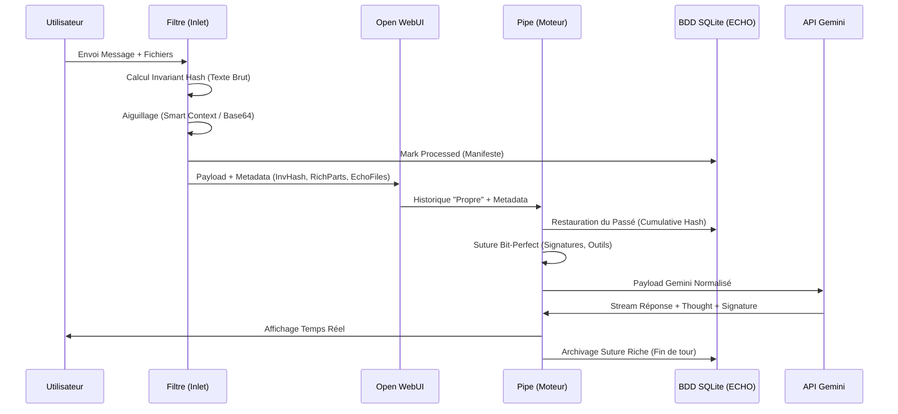

# Architecture de Gestion du Contexte ECHO (v2026)
**Document de Référence Technique - Confidentialité ECHO**

## 1. Philosophie : L'Architecture "Ombre Riche" (Rich Shadow)

Le framework ECHO repose sur un constat critique audité sur Open WebUI (OWUI) : **l'historique des messages est volatil.** OWUI "nettoie" systématiquement les injections faites par les filtres (inlets) avant de stocker les messages en base de données. 

Pour garantir que Gemini conserve une mémoire parfaite (Smart Context, Raisonnement CoT, Artefacts), ECHO implémente une **Ombre Riche** : un miroir haute-fidélité de la session stocké dans une base SQLite locale (`user-XXX.db`), capable de "réparer" l'historique d'OWUI avant chaque envoi à l'API Gemini.

### Diagramme de Flux de la Suture Cognitive

---

## 2. Infrastructure de Données & Moteur de Hashage

Situé dans : `14-owui-libs/echo_utils.py` (Classe `EchoStateManager`)

### A. Le Schéma SQL (5 Tables Spécialisées)
*   **`suture_index`** : PK `cumulative_hash`. Lie un point temporel à un contenu riche.
*   **`rich_payloads`** : PK `invariant_hash`. Stocke les contenus lourds (Résumés, Base64) de façon factorisée (déduplication).
*   **`cognitive_signatures`** : PK `cumulative_hash`. Stocke les `thoughtSignature` de Google (Ancres logiques).
*   **`tool_journal`** : PK `cumulative_hash`. Stocke les entrées/sorties des outils (`functionCall` / `functionResponse`).
*   **`thought_archive`** : PK `cumulative_hash`. Stocke le texte brut de la réflexion pour l'historique humain (non réinjecté).

### B. Les Algorithmes de Hashage
1.  **`calculate_invariant_hash(role, content, files)`** :
    *   **Objectif** : Créer une empreinte unique du message "propre".
    *   **Logique** : Hash du rôle + texte brut + IDs de fichiers triés.
    *   **Stabilité** : Utilise `json.dumps(sort_keys=True)` pour garantir que le hash est identique même si les clés JSON changent d'ordre.
2.  **`calculate_cumulative_hash(invariant, parent_hash)`** :
    *   **Objectif** : Créer une chaîne cryptographique (Blockchain-like).
    *   **Logique** : Hash de l'invariant actuel + hash cumulatif du message précédent.
    *   **Puissance** : Détecte instantanément le *Branching* (édition d'un message passé).

---

## 3. L'Algorithme de Gestion du Contexte

### Étape 1 : Phase d'Inlet (Le Filtre)
Fichier : `11-owui-filters/new_context_filter.py` | Fonction : `inlet()`

1.  **Identification Préventive** : Calcule l'Invariant Hash du dernier message `user` **avant** toute modification.
2.  **Transport Meta** : Stocke cet ID dans `metadata["_echo_invariant_hash"]`.
3.  **Aiguillage Intelligent (`_process_file_task`)** :
    *   Si Fichier > 256 Ko -> Appelle Gemini Flash -> Produit un **Smart Context** (Texte).
    *   Si Image/Audio -> Produit une **Part Binaire** (Base64).
    *   Si Texte -> Produit une **Part Texte**.
4.  **Encapsulation Riche** : Regroupe l'Environnement (`etat_echo`) et les contenus produits dans `metadata["_echo_rich_parts"]`.
5.  **Sanctuarisation** : Déplace les fichiers originaux dans `metadata["_echo_files"]` et vide `body["files"]` pour neutraliser le moteur natif d'OWUI.

### Étape 2 : Phase de Suture (Le Pipe)
Fichier : `10-owui-pipes/pipe_engine.py` | Fonction : `prepare_context()`

Le Pipe parcourt l'historique séquentiellement pour reconstruire la "Vérité ECHO" :

1.  **Calcul du fil d'Ariane** : Recalcule les hashes invariants et cumulatifs pour chaque message reçu.
2.  **Respect de l'Identité (v164.1)** : Pour le dernier message, il ignore son propre calcul et utilise l'ID passé par le Filtre (évite le paradoxe du hash modifié).
3.  **Restauration Bit-Perfect** :
    *   **Messages User** : Si une version riche existe en BDD, il remplace le texte court par la liste complète des parts (Environnement + Smart Context + Base64).
    *   **Messages Model** : Il récupère la `thoughtSignature` en BDD et l'injecte dans la première part de texte. Il restaure également les `functionCall` passés.
    *   **Messages Tool** : Il restaure la `functionResponse` exacte depuis le `tool_journal`.

---

## 4. Scénarios Dynamiques

### A. Conversation Simple
*   **Tour 1** : L'Invariant est stocké.
*   **Tour 2** : Le Pipe reconnaît l'Invariant du Tour 1, restaure la signature CoT de la réponse. Gemini "sent" la continuité logique sans voir le texte de sa pensée passée.

### B. Outils en Série et Parallèle
*   **Suture de Tool Call** : Gemini produit un `functionCall`. Le Pipe stocke l'ID de l'appel et la signature CoT associée.
*   **Restauration** : Au tour suivant, le Pipe garantit que l'appel d'outil est toujours précédé de sa signature exacte.
*   **Parallélisme** : Comme chaque bloc Tool/Assistant est hashé intégralement, ECHO restaure l'intégralité du bloc d'appels simultanés sans désynchronisation des IDs.

### C. Gestion des Fichiers (Smart Context)
*   **Tour d'Analyse** : Le filtre injecte le résumé Markdown. Le Pipe le sauvegarde comme "Rich Payload".
*   **Tours de Suivi** : Même si OWUI a "oublié" le résumé, le Pipe le réinjecte systématiquement car il reconnaît le message utilisateur d'origine. Le KV Caching de Gemini est maximisé car le préfixe reste stable.

---

## 5. Relais et Normalisation Gemini
Fichier : `10-owui-pipes/pipe_engine.py` | Fonction : `_ensure_gemini_parts()`

Cette fonction est le garde-fou du protocole. Elle convertit les formats hétérogènes en format natif Google :
*   Supprime les clés `"type": "text"`.
*   Convertit `inline_data` (OWUI) en `inlineData` (Gemini).
*   Valide que chaque `part` est un dictionnaire propre.
*   **C'est cette fonction qui prévient les erreurs API 400.**

---

## 6. Authentification et Enrollment (Gateway)

### A. Détection OAuth Stealth
Fichier : `11-owui-filters/new_context_filter.py`
Le filtre surveille si le message utilisateur contient un code commençant par `4/`. Si oui, il l'intercepte, le retire du chat et le passe au Pipe via `body["_auth_token"]`.

### B. Gestion du Cycle de Vie (AuthService)
Fichier : `10-owui-pipes/pipe_engine.py` | Fonction : `get_auth_url()`

1.  **PKCE Challenge** : Génération d'un `verifier` et d'un `challenge` cryptographiques.
2.  **Règle des 300s (Stabilisation)** : Si un challenge a été généré il y a moins de 5 minutes, il est **réutilisé**. Cela permet de gérer les requêtes concurrentes d'OWUI pendant que l'utilisateur fait son copier-coller.
3.  **Enrollment** :
    *   L'utilisateur colle le code.
    *   `exchange_code()` : Échange le code `4/` contre un `Refresh Token` via les API Google.
    *   Stockage sécurisé dans `auth_data` (BDD Utilisateur).
4.  **Rafraîchissement** : `get_valid_credentials()` vérifie l'expiration. Si expiré, utilise le `Refresh Token` pour obtenir un nouveau `Bearer Access Token` de façon transparente.

---
*Document maintenu par ECHO Architecture. Version Stack : 5.44.6*
